# Create a CICD pipeline to deploy a .Net Core application on Amazon ECS Fargate environment
> In this lab we will create a CICD pipeline on Azure DevOps using AWS Tools for VSTS.
## Prerequisites
* An AWS account and an associated IAM User account. 
* Validate access to the sample source code repository in Github by browsing to this url https://github.com/awsimaya/ECSFargate.git 

## AWS Environment Setup

> This is a critical step. Ensure you follow the instruction accurately _before_ you proceed. Here we will set the AWS region we are going to work on. It is necessary to follow the instructions carefully to ensure successful completion of the lab.

* Set your region to EU-WEST-1 (Ireland). See picture below and ensure your setup is set right.

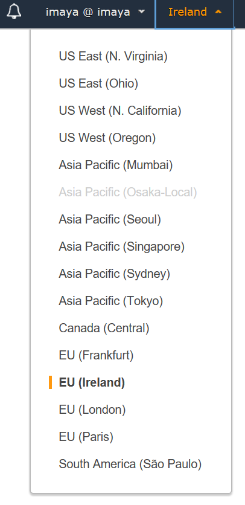

## Create a new Elastic Container Repository

> In this section, we will create a new Elastic Container Repository to host our container images. These images will be used in our example to create container instances that will run as part of a cluster on the ECS 

* Login to AWS Console and navigate to Elastic Container Service home page
* Click on **Get Started**
* Enter _hellofargaterepo_ in the **Repository name** text field and click **Next step**
* Your new Elastic Container Repository is created successfully

## Create a new IAM User for AzureDevOps
> [Optional] If you already have Secret Access Key ID and Secret Access Key of an IAM User account to be used with Azure DevOps then you can skip this section. In this section, we will create a new IAM user account that will be used by your Azure DevOps service to deploy resources in your AWS Account. 

*Click on IAM Service 
*In the navigation pane, choose **Users** and then choose **Add user**.
*Type the user name for the new user. This is the sign-in name for AWS.
*Select only programmatic access. This creates an access key for each new user. You can view or download the access keys when you get to the Final page.
*Click on **Next: Permissions**
*Select Attach existing policies directly
*Select Administrator Access 
*[Note - This is not a best practice to provide Administrator Access. Its recommended to follow least access privilege and limit permissions to the resources that would be required from AzureDevOps account. This could vary depending upon your use case and scenarios. Example you may chose to create different IAM User account for Non-Prod Vs Prod and appropriately provide the  necessary permissions following least access privilege principle.]
*Click on **Next: Review**
**Click on **Create User**
*Save the Secret Access Key and Access Key ID to be used later in this lab. 

# Setup Azure DevOps Environment
## Install AWS Tools for Azure DevOps
> In this step, we will install AWS Tools for Azure DevOps on to your account. This will allow us to leverage the powerful features the add-on provides to created CICD tasks on AWS

* Navigate to [Visual Studio Marketplace](https://marketplace.visualstudio.com/items?itemName=AmazonWebServices.aws-vsts-tools) and click on **Get it free** button as shown in the image below
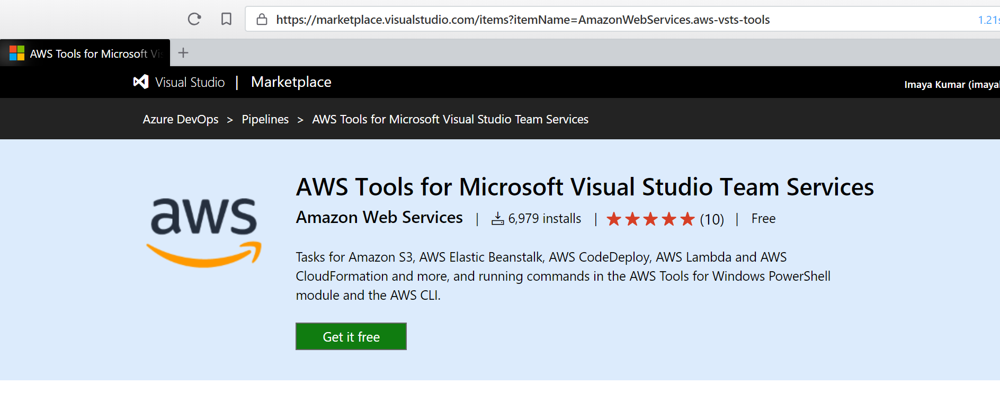
## Configure AWS Account
* If you're logged in to Azure DevOps already, you will be taken to your Azure DevOps account where you can select the Organization as shown below. 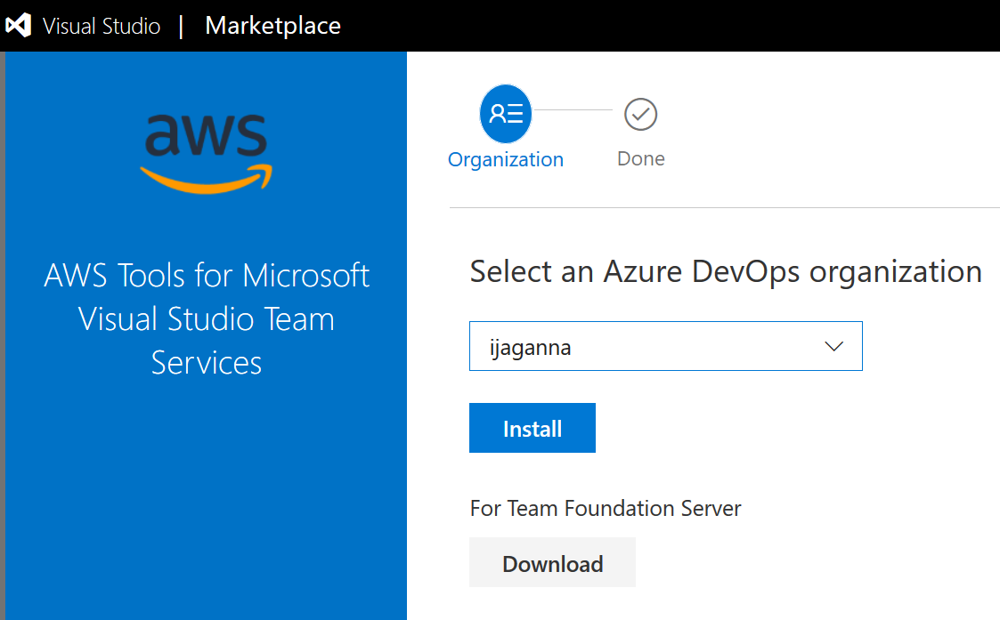 
* Once you click, AWS Tools for VSTS will be installed on the organization successfully. You will screen like the below if the the process was successful. Click **Proceed to organization**
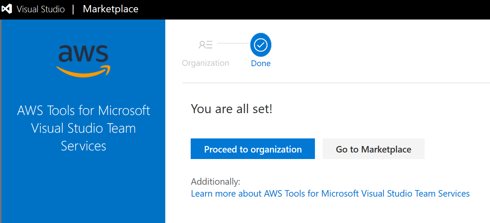

# Create Azure DevOps Pipeline
## Setup AWS IAM User for Azure DevOps account to manage AWS resources t

## Setup AWS Connection with Azure DevOps
> In this step, we will create a service connection to AWS on Azure DevOps. This will allow us to easily execute AWS specific tasks by simply selecting the service connection within the task itself.

* On your Azure DevOps home page, go ahead and create a project. Use default settings.
* Under Project Settings > Service connections, click on **New Service connections** and select **AWS** from that list
* You will see a window similar to the screenshot below. Give a connection name, enter the Access Key Id and Secret Access Key of the IAM User Account to be used by Azure DevOps. Click **OK**
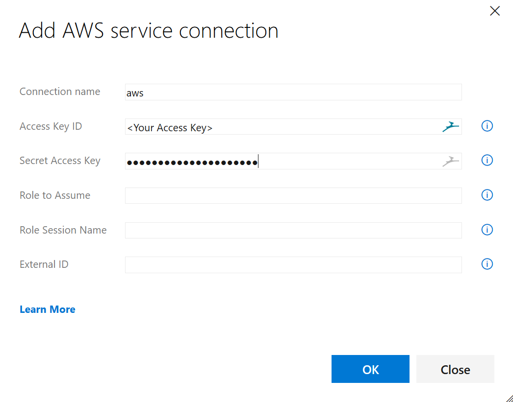 
* You will see a screen like the one below once this process is complete
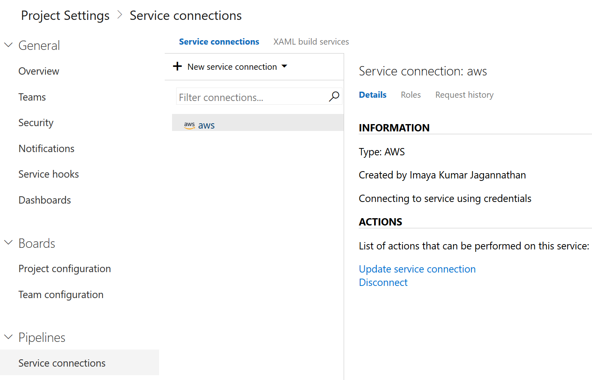
## Create a Build Pipeline

> In this step, we will create a Build pipeline to build a docker container image that contains our application and also push it to AWS Elastic Container Repository

* Navigate to **Repos** page on the left navigation section. The screen should look similar to this below
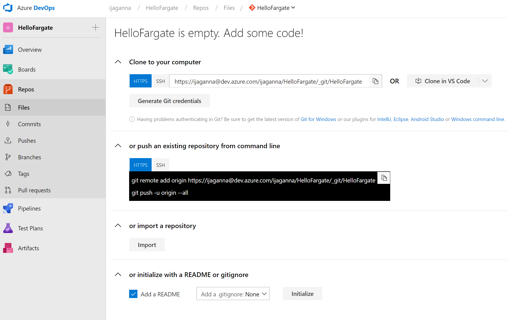
* Click on **Import** under **or Import a repository**
* Enter the GitHub URL (https://github.com/awsimaya/ECSFargate.git). Click **Import**. Now Azure DevOps will clone the project from GitHub into its own git repo
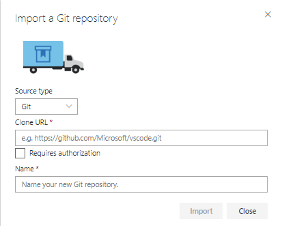
* Click **Builds** under **Pipelines**. On this page, click **New Pipeline**
* Your page should look like the one below
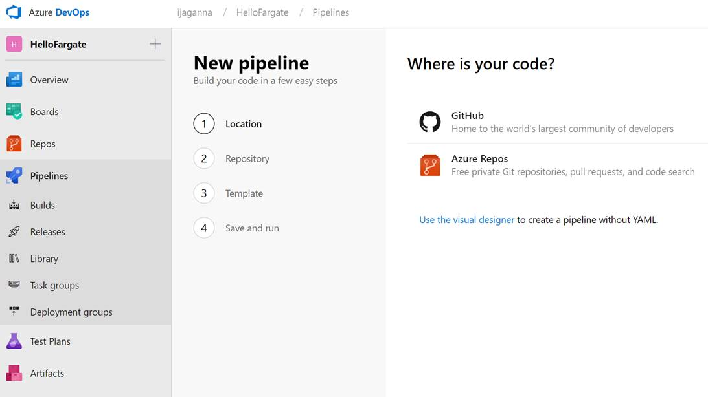 Click **Use the visual designer** link under **Where is your code?** section 
* In the next step, select the repo you want to connect to and click **Continue**
* On the **Select a template** screen, select **Empty Job** as shown in the screenshot below and click **Apply**
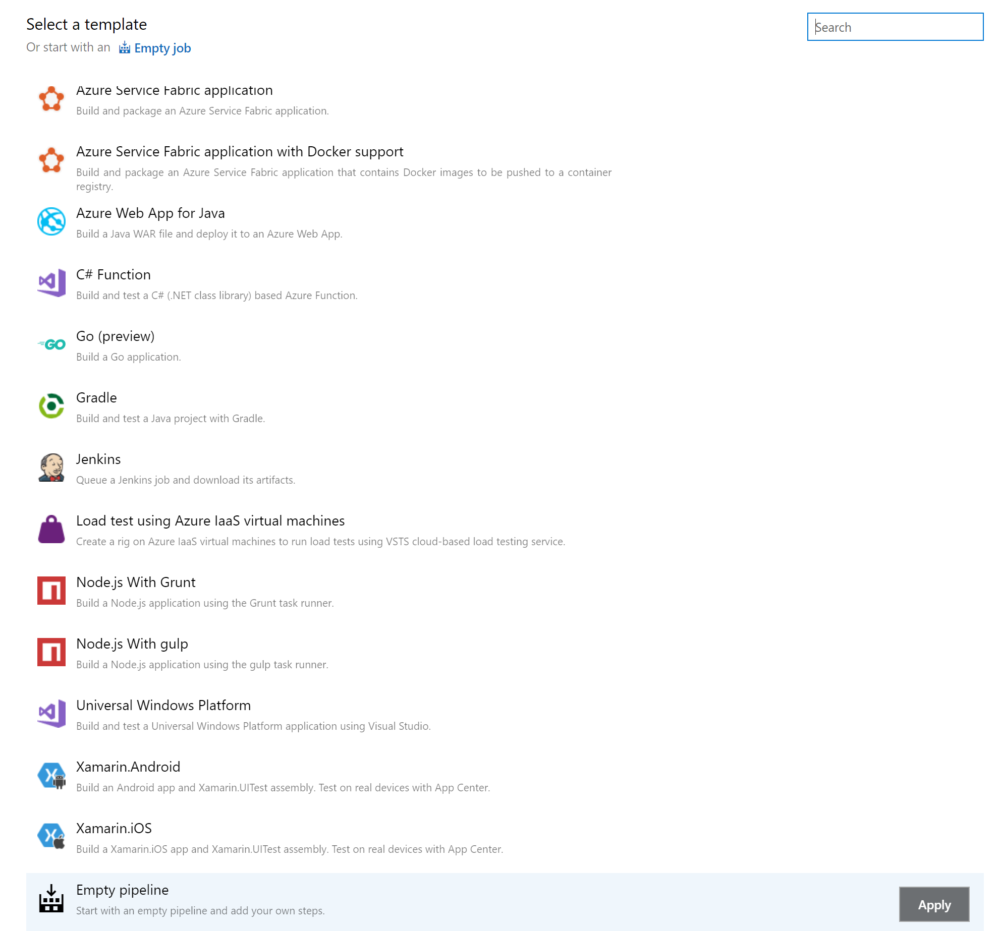
* Now you should be on the **Tasks** tab inside the Build pipeline. Here, to the right hand side for the drop down **Agent Pool** under **Agent job**, select _Hosted Ubuntu 1604_. Leave other fields to the default values.
* Add a task by click on the **+** sign next to **Agent job 1** on the left hand side. Type **Command** on the search bar on the right hand side. You should see the **Command Line** task as shown below
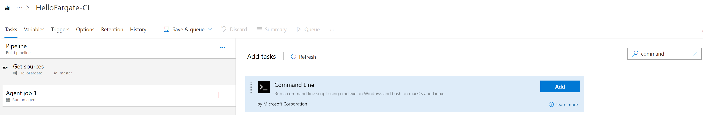. Now click **Add**
* Once added, name the task **Build Docker Image** and enter the command _docker build -t hellofargate ./HelloFargate_ in the **Script** field as shown below
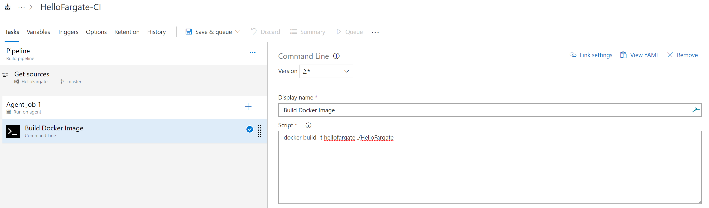
* Once again click on the + symbol next to  **Agent job 1**. Type _aws_ on the search field which will list all **AWS** tasks. 
* Select _AWS Elastic Container Registry Push_ task and click **Add**
* Name the image _Push Image to ECR_. Select the name of the AWS Credentials you setup earlier under **AWS Credentials** drop down. Select _EU (Ireland) [eu-west-1]_ as Region. Select _Image name with optional tag_ for Image identity field. Enter _hellofargate_ for the **Source Image Name** field. Enter _latest_ for **Source Image tag** field. Enter _hellofargaterepo_ for the **Target Repository Name** field. Enter _latest_ for the **Target Repository Tag** field. Now click on **Save pipeline** to save your changes. The screenshot below shows all the settings for easier understanding.
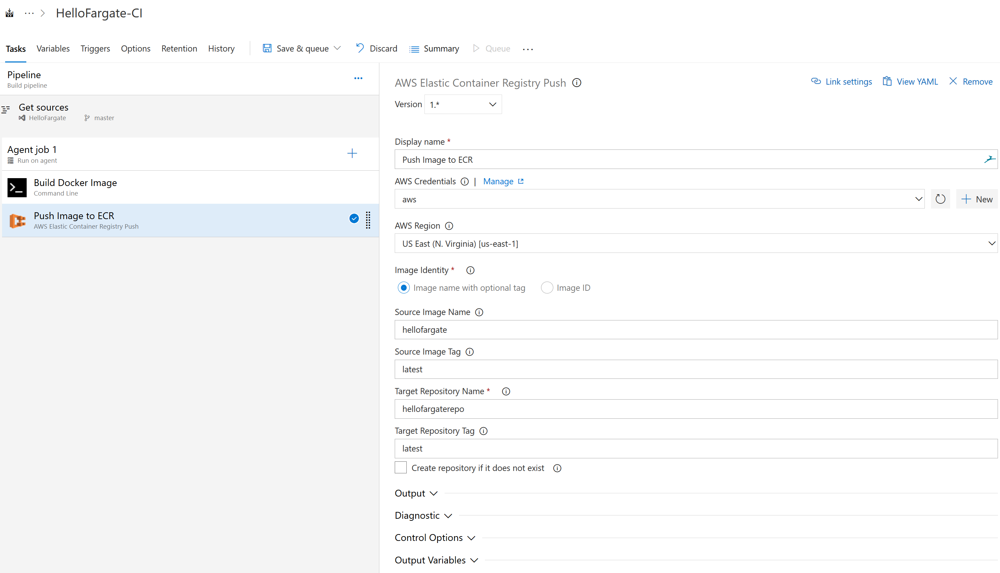
* You can rename the build pipeline by just clicking on **HelloFargate-CI** at the top and typing a name as shown below
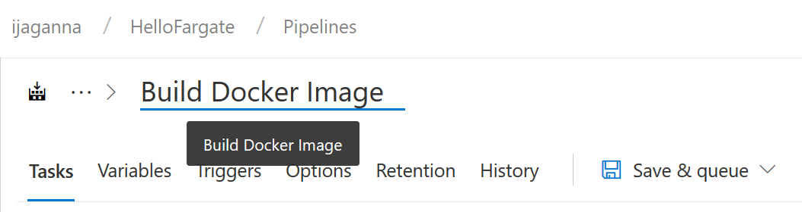

> It might take around 2 minutes or so for the image to be published to the repository. Go ahead and start the next step (_Create ECS Task Definition_) till this gets completed.

* Go to the AWS ECR console and click on **hellofargaterepo** repository and make sure there is a new entry and the **Pushed at** column reflects the latest timestamp
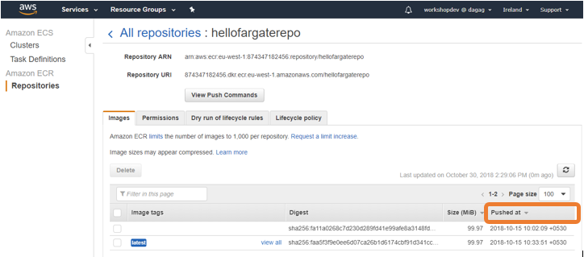

## Create ECS Task Definition
> In this step, we are going to create a _Task Definition_ that will be used to create the container instances in the cluster. A task definition is the core resource within ECS. This is where you define which container images to run, CPU/Memory, ports, commands etc.

* Login to AWS Console and navigate to Elastic Container Service home page
* Go to **Repositories** under **Amazon ECR** and click on the **hellofargaterepo** repository
* Select the value of **Repository URI** and press **Ctrl+C** or **Cmd+C** if you're using a Mac. You will need this in the next step
* Select **Task Definitions** and click on **Create new Task Definition** 
* On the next screen, select **FARGATE** launch type and click **Next**
* On the next screen, give the Task Definition a name. In this exercise, I will call it _MyNextTaskDefinition_
* Select _0.5 GB_ for Task memory and _0.25 vCPU_ for Task CPU dropdowns respectively
* Leave **Task Role** and **Network Mode** fields to their default values. 
* Your screen should look similar to the one below
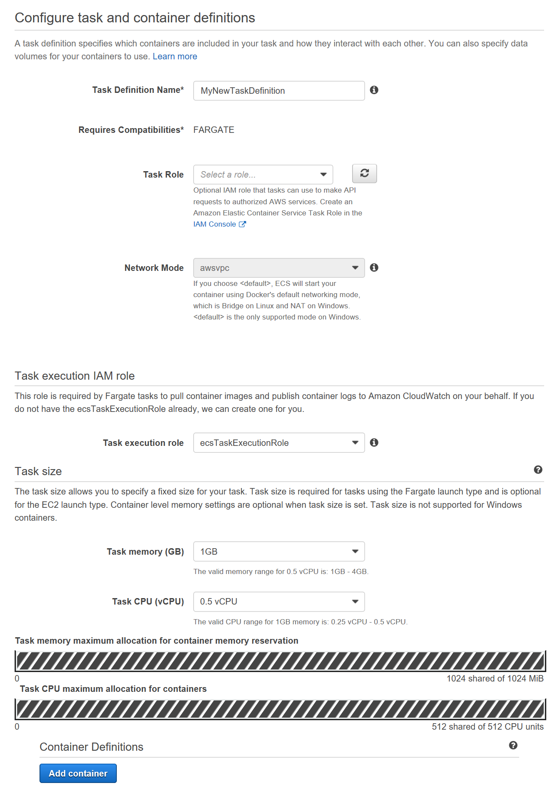
* Click **Add Container**
* Name the container as _hellofargatecontainer_
* Copy and paste the Repository URL from ECR and paste into **Image** textbox. Make sure you add the tag _:latest_ to the end of the string. Ensure there are no white spaces at the end. 
* Ignore the **Private repository authentication** and **Memory Limits (MiB)** fields 
* Add _80_ to Port mappings 
* Ignore the **Advanced container configuration section**
* Click on **Add** button on bottom right corner
* Your screen should look similar to the one below
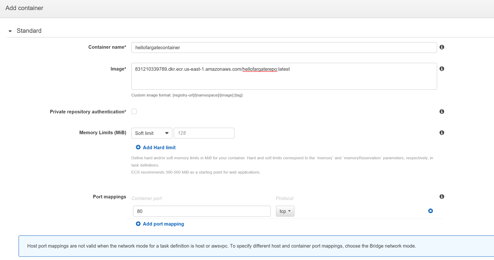
* Now click **Create**
* Your Task definition is created successfully
* Your screen should look similar to the one below
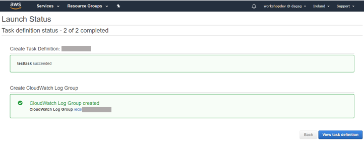

## Create ECS Cluster
> In this section we are going to create a Elastic Container Service cluster. A cluster typically has one or more nodes , which are the workermachines that run your containerized applications and other workloads.

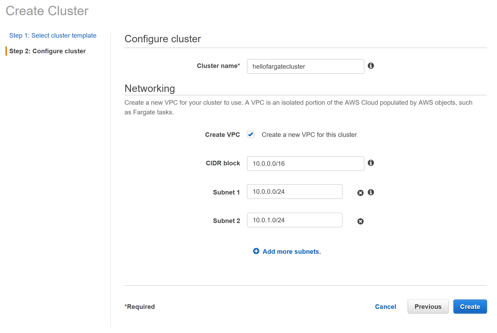
* Click on **Clusters** on the ECS home page
* Click on **Create Cluster**
* Select **Networking Only** option and click **Next step**
* Name the cluster as _hellofargatecluster_ 
* Check the **Create VPC** checkbox 
* Delete Subnet 2 by clicking the _x_ to the right and leave other values to default
* Click **Create**
> This step will take about a minute to complete. In the background, AWS is creating a [CloudFormation](https://aws.amazon.com/cloudformation/) stack with all the input settings.

* ECS cluster is created sucessfully
> Once complete, make sure you take a note of the VPC name that we just created, since we will use it in the future steps
* Click on **View Cluster** to see the cluster

## Create a new Service
* On the newly created cluster page, click on **Create** under **Services** tab
* Select _FARGATE_ for **Launch type** option
* Make sure the Task Definition and the Clusters are selected to the ones you just created
* Enter _hellofargateservice_ for Service name field
* Enter _1_ for Number of tasks field and leave everything else as is. Click **Next step**
* Make sure the VPC drop down has the name of the VPC you just created 
* Click on the **Subnects** drop down and select the subnet that comes up
* Click on **Edit** for **Security groups** and ensure the **Inboud rules for security group** has Port 80 selected. Look at the image below for clarity. Click cancel to exit the **Configure security groups** page
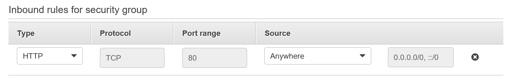
* Select _None_ for Load balancing
* Under **Service Discovery (optional)** section uncheck the **Enable service discovery integration** checkbox as this is not required for this lab and click **Next Step**
* Leave the **Set Auto Scaling** to _Do not adjust the service's desired count_ as it is
* Do a quick review of the **Review** screen and click **Create service**
* The cluster service is now created successfully
* Click on **View Service**
* Go to the **Tasks** tab and check the **Last status** column. It will refresh its status to **RUNNING** and turn green once the provisioning is complete
* The current screen should look similar to the one below. Notice that the **Last status** column says _PROVISIONING_ which means the taks is currently being executed
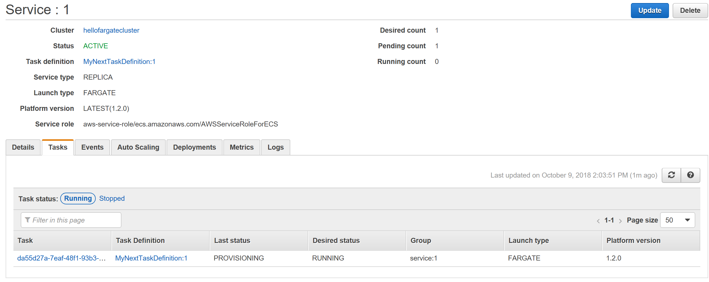
* Once the value on **Last status** column says **RUNNING** and is green, click on the task name under **Task** column
* Copy and paste the value of **Public IP** under **Network** on to a new browser tab and press Enter
* You should see the home page of the your new application running on Amazon ECS Fargate
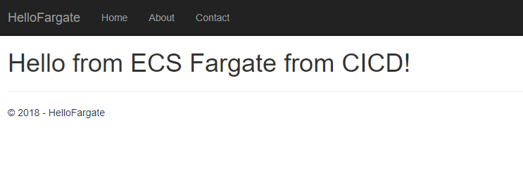

## Create a Release Pipeline
* Go to **Releases** page on your Azure DevOps project
* Click **New pipeline**
* Select **Empty job** under **Select a template**
* Enter _Prod_ for Stage name field
* Change the name of the pipeline to _Release to Prod_. 
* Now your screen should look similar to the below screenshot
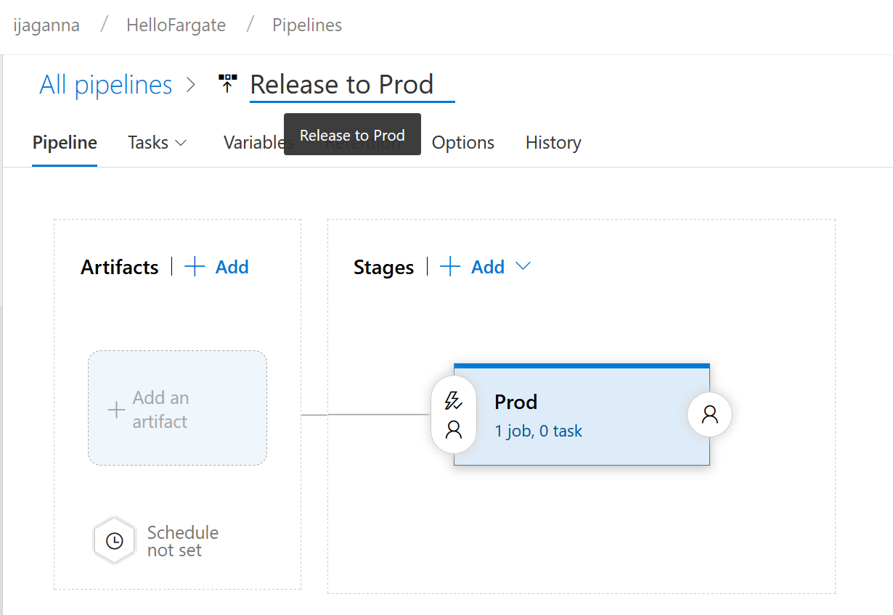
* Hover your mouse over **1 job, 0 task** link and click on the + sign that becomes visible. This will allow you to add new tasks to the pipeline.
* In the next screen, under **Agent job**, select _Hosted 2017_ for **Agent pool** drop down
* Now click on the + sign next to **Agent job** and type _Command_ in the search field. Select the **Command Line** task and click **Add**
* Name the task _Install AWS CLI_ and enter _pip install awscli_ in the **Script** field
* Click on the + sign next to **Agent job**. Type **aws** in the search field. Select **AWS CLI** task and click **Add**
* Name the new task _Update ECS Service_. Select the name of the AWS credential you configured earlier.
* Select _EU (Ireland) [eu-west-1]_ as region
* Enter _ecs_ in the **Command** field. 
* Enter _update-service_ in the **Subcommand** field. 
* Enter *--cluster hellofargatecluster --service hellofargatecontainer-service --force-new-deployment* in the **Options and parameters** field
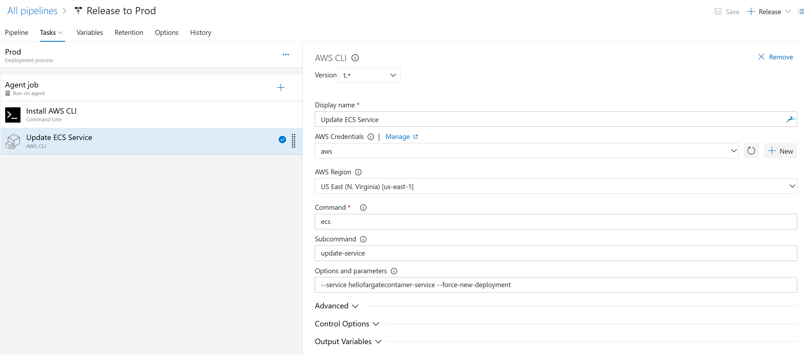
* Save the changes.

## Create a Release
> In this step, we will create a release using the release pipeline we created in the previous step. Doing this will deploy the container into the cluster using the task definition it is configured to.

* Go to **Releases** and select the release pipeline you created earlier.
* You should see a screen similar to the one below. Click **Create a release**
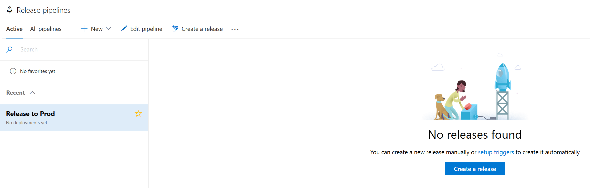
* Select _Prod_ in the drop down for **Stages for a trigger change from automated to manual** and click **Create**
* In the next screen, click on **Release-1** that appears on the green bar
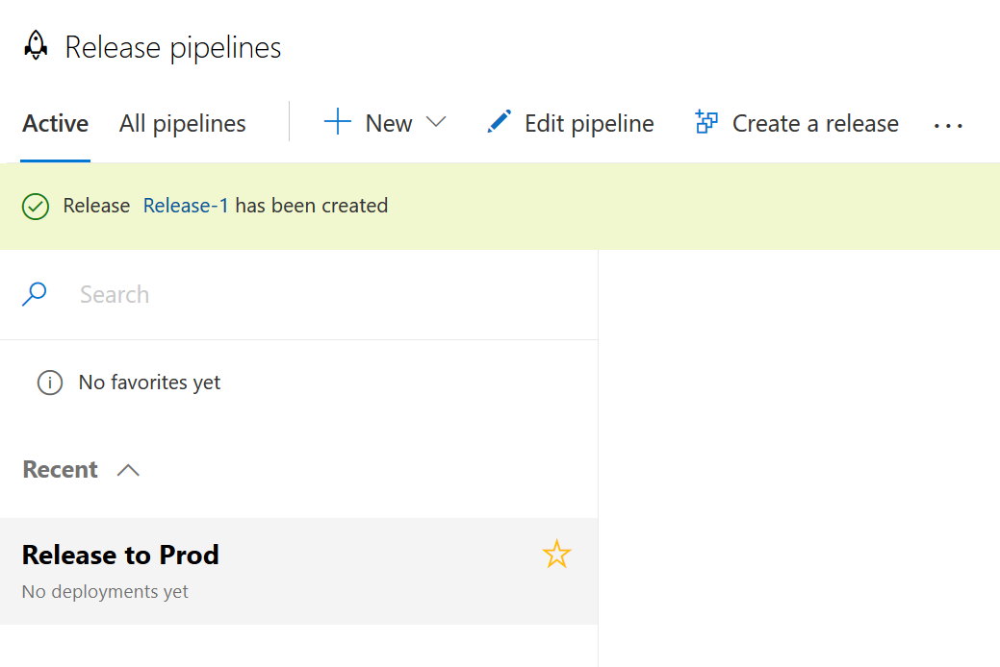
* Your next screen will look similar to the one below. Hover the mouse arrow on **Prod** stage rectangle. Click on **Deploy** button.
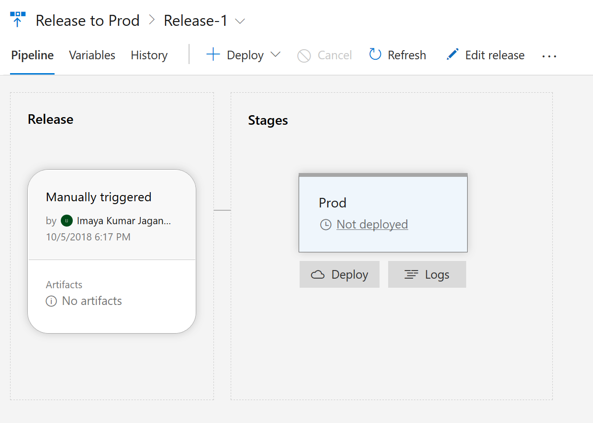
* Simply click **Deploy** in the pop-up screen
* The job will be queued and will be picked up once an agent gets free. After its complete, your screen should look like the one below
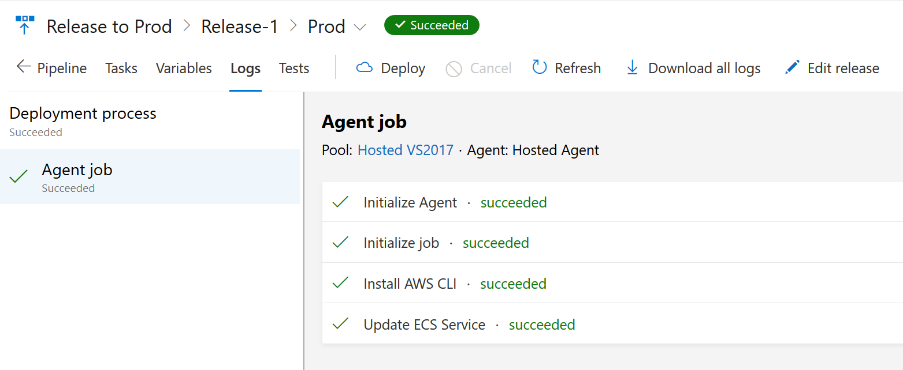

## Final Steps
* Now you have a fully functional Build and Deploy pipeline setup for your application running on Amazon Elastic Cluster Service
* Go ahead and make some simple change to the project and do a git push to the repo.
* Queue a Build and a Release to see your changes reflecting successfully on your target environment